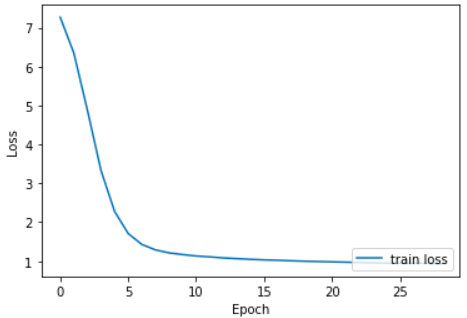
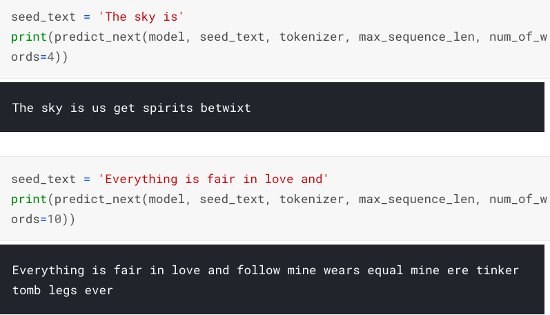

# text-generation

In this project [Shakespeare plays](https://www.kaggle.com/kingburrito666/shakespeare-plays) by [LiamLarsen](https://www.kaggle.com/kingburrito666) is used to create a deep learning model which will be able to `generate text` using some input text.

**While doing all of this we will go through:**

- `Preprocessing` text data
- Building multilayer `Bidirectional RNN` model
- Saving `wording embeddings` learned by the learning algorithm

## Table of contents

- [Getting started](#getting-started)
- [Deep learning model performance](#deep-learning-model-performance)
- [License](#license)

## Getting started

This deep learning model is trained using `GPU` and to work in the same environment having packages with versions which were used while making this notebook, go to [Kaggle](https://www.kaggle.com/akashsdas/text-generation) where the kernel is saved.

In [Kaggle](https://www.kaggle.com/akashsdas/text-generation) kernel you'll find `embedding vectors and metadata` which can be used to display `embedding` learned by the model using `Tensorflow Projector`.

## Deep learning model performance

The data is text which has `4,583,798` words but only `500,000` words are used train the model. There is no `validation` or `testing` set. This model is trained for `20 epochs`.

**Model's performance by the last (20th) epoch**

**Text generated by the model**

**Word cloud for training text**

## License

[APACHE LICENSE, VERSION 2.0](./LICENSE)
